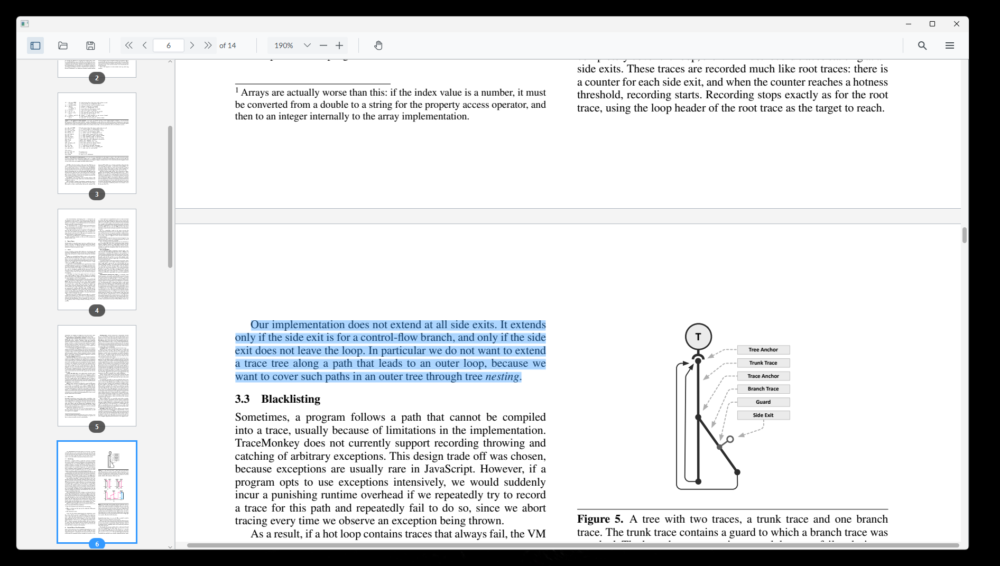
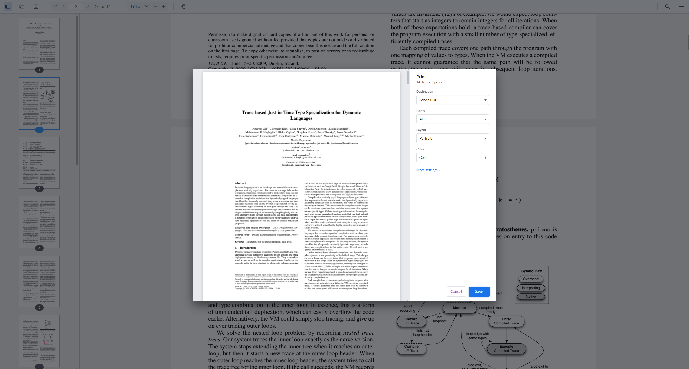
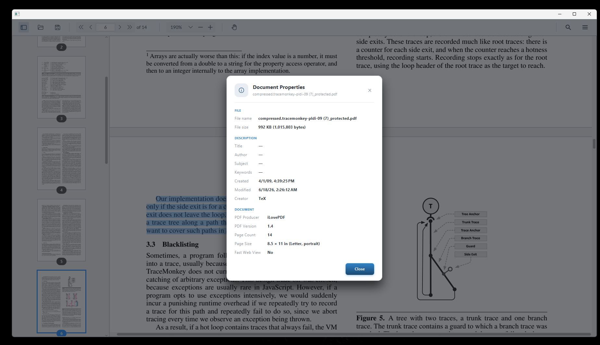
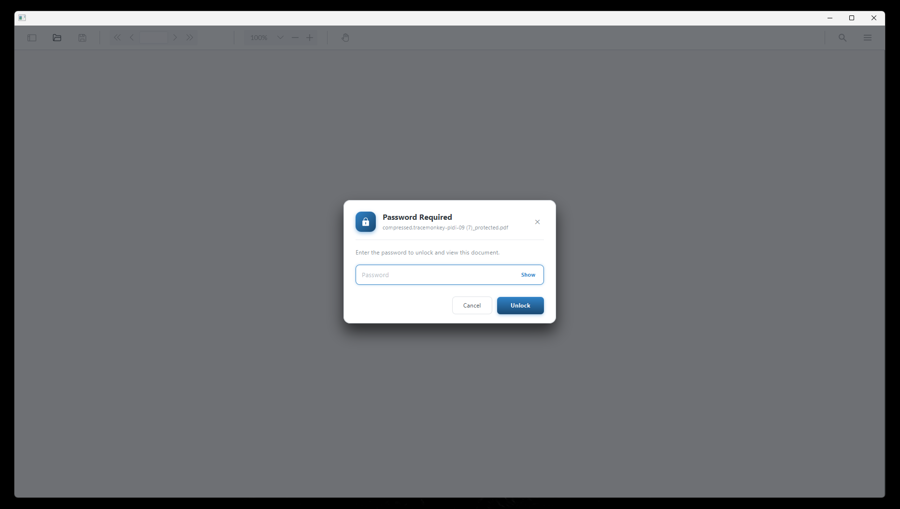
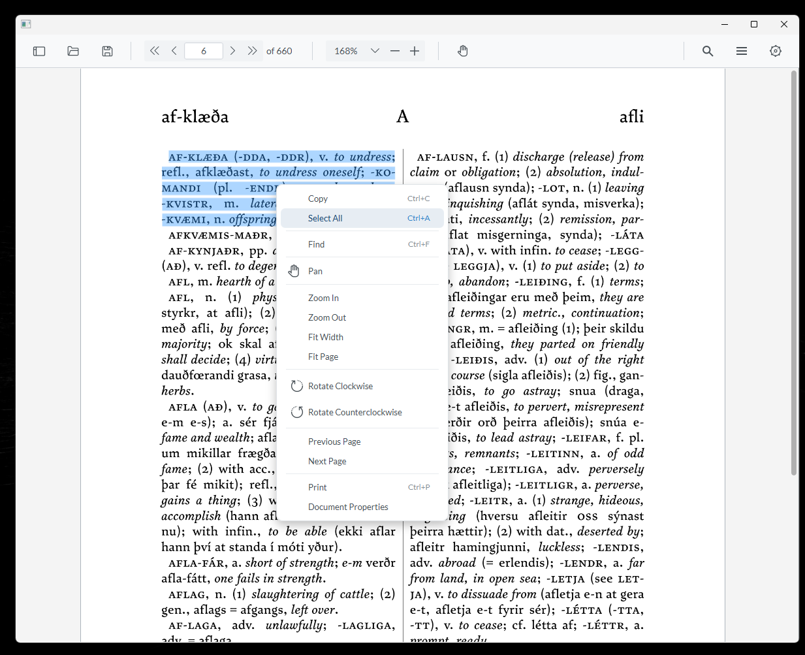
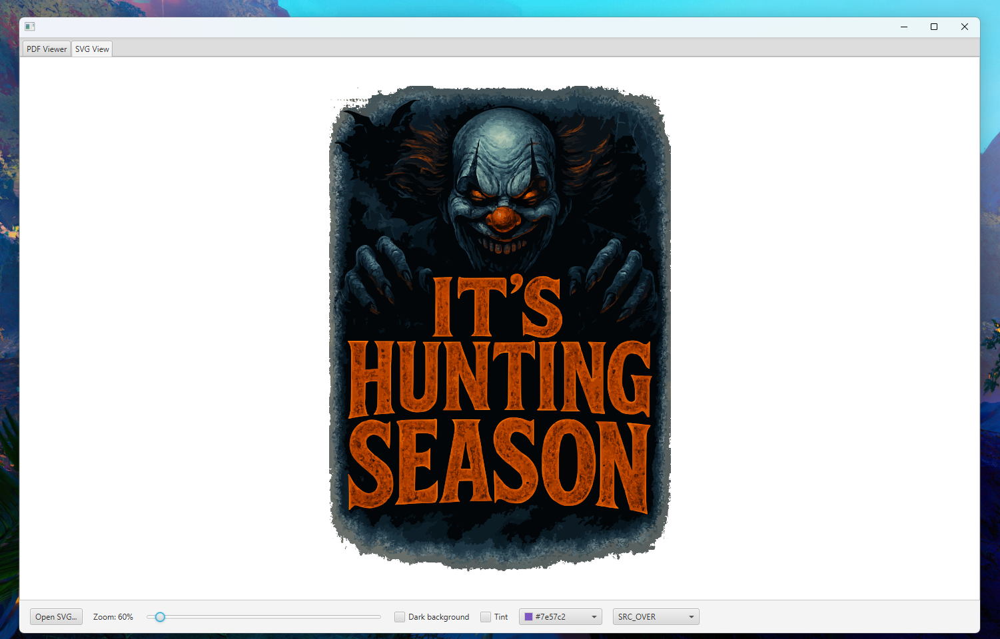
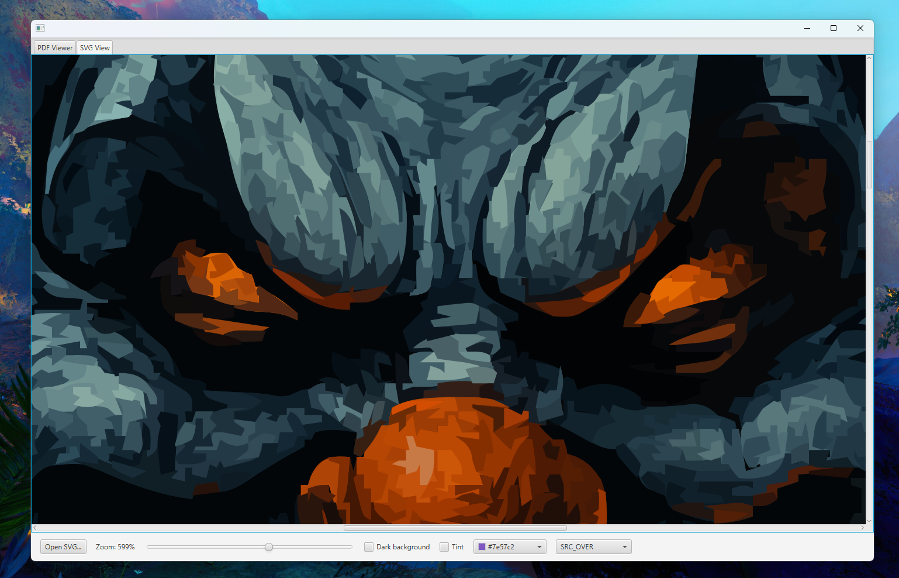

# Ultimate PDF Viewer

A complete PDF viewer for JavaFX. It renders, reads, searches and displays PDF
documents using a native [PDFium](https://pdfium.googlesource.com/pdfium/)
engine bound through the Java Foreign Function & Memory API (Panama). There is
no AWT, no Swing and no PDFBox anywhere in the stack, so rendering is crisp,
fast and pixel-perfect at any zoom level.

The project is split into a reusable rendering engine and a ready-to-drop-in
viewer control, so you can use as much or as little of it as you need. Either
embed the full `PdfViewer` control (toolbar, thumbnails, search, the lot) into
your app with a single line, or pull in just the `nfx-pdfium` engine and build
your own UI on top of it.

The same build also ships **`nfx-svg`** — a completely standalone JavaFX **SVG**
library backed by native [Skia](https://skia.org). It renders SVG documents
**pixel-perfect at any size** through a reactive, DPI-aware `SvgView` node, and
shares nothing with the PDF stack, so you can drop it into any JavaFX app on its
own. See [SVG rendering with `nfx-svg`](#svg-rendering-with-nfx-svg).

> Use at your own risk. This software is provided as-is, without any warranty.
> See the [License and credit](#license-and-credit) section below for the full
> terms. In short: you are free to use it, including in commercial projects,
> as long as you keep the attribution to XDSSWAR / Xtreme Software Solutions.

## Screenshots

|  |  |
|:---:|:---:|
| <br>**Continuous view — text selection & thumbnail sidebar** | <br>**Print dialog — live, scrollable page preview** |
| <br>**Document Properties card** | <br>**Password prompt for encrypted documents** |
| <br>**Page context menu — text, find, pan, zoom, rotate & more** |  |
| <br>**`SvgView` — crisp when zoomed out** | <br>**`SvgView` — razor-sharp zoomed in (re-rasterized, never upscaled)** |

## Modules

The repository is a single Gradle build with four modules:

| Module | What it is |
|---|---|
| **`nfx-pdfium`** | The standalone, cross-platform JavaFX PDF engine. Native PDFium via FFM plus a thin C shim. Public API under `xss.it.nfx.pdfium.*`. Renders pages, extracts text, runs searches and ships a reactive, zoomable page node. Usable entirely on its own — see [`nfx-pdfium/README.md`](nfx-pdfium/README.md). |
| **`nfx-svg`** | A standalone, cross-platform JavaFX **SVG** library backed by native [Skia](https://skia.org) (its `modules/svg` engine) through FFM and a thin C++ shim. Public API under `xss.it.nfx.svg.*`. Renders SVG **pixel-perfect at any size** and ships a reactive, DPI-aware `SvgView` node with optional recolor tinting. Depends only on the JDK and JavaFX — see [SVG rendering with `nfx-svg`](#svg-rendering-with-nfx-svg). |
| **`pdf-viewer`** | The `PdfViewer` JavaFX control built on top of the engine: toolbar, thumbnail sidebar, single-page and continuous views, search panel, document-properties card and password prompt. Public API under `xss.it.ultimate.pdf.viewer.*`. |
| **`demo`** | A small runnable JavaFX app with the `PdfViewer` and an `SvgView` showcase in two tabs. Launch it with `./gradlew :demo:run`. |

All rendering, text extraction and search come entirely from `nfx-pdfium`
(PDFium). The `pdf-viewer` module is purely the user interface and the viewer
state around it.

## Features

### Rendering

- Native PDFium rendering — accurate, fast, and faithful to the original document.
- Pixel-perfect zoom. Pages render at the exact device-pixel resolution for the
  current zoom and screen scale, so text and lines stay sharp instead of getting
  blurry when you scale up. During an active zoom gesture the image stretches
  instantly and then re-renders crisply a moment later.
- High-DPI / Retina aware. Honours the screen output scale automatically.
- Configurable render DPI for pages and, separately, for thumbnails.
- Support for encrypted / password-protected documents, with a built-in prompt
  and retry-on-wrong-password handling.

### Viewing and navigation

- Two view modes: single page at a time, or a smooth continuous scroll through
  the whole document.
- Multi-column continuous layout. Show one page per row, or two side-by-side for
  a facing-page / book layout.
- Page navigation: first, previous, next and last page, plus jump-to-page.
- Fit modes: fit to width, fit to height, or no fit (free zoom).
- Zoom in, zoom out, a zoom menu, and configurable minimum and maximum zoom
  limits.
- Page rotation: rotate the current page left or right in 90-degree steps.
- Full-screen mode toggle (can be allowed or disallowed by the host app).
- Pan tool for dragging the page around when zoomed in, and a separate text
  selection tool.

### Thumbnails

- A thumbnail sidebar you can show or hide.
- Click a thumbnail to jump to that page; the current page is highlighted.
- Adjustable thumbnail size and render DPI.
- Optional thumbnail caching to keep scrolling smooth on large documents.

### Text and search

- Real text extraction (not OCR) straight from the PDF.
- Click-and-drag to select text (a single click or a right-click never selects),
  with `Ctrl+C` to copy and `Ctrl+A` to select all. Selection can span pages in
  the continuous view.
- Full-document search (`Ctrl+F`) with a search panel, a results list you can
  step through, highlighted matches on the page and a configurable highlight
  color, plus match-case, whole-word and diacritics options.

### Document information

- A "Document Properties" card showing file name, file size and fast-web-view
  (linearization) status, together with the embedded metadata — title, author,
  subject, keywords, creator, producer, creation and modification dates, the PDF
  version and the first page size.

### Printing

- A Chrome-style print dialog (`Ctrl+P`, or from the page menu) with a live,
  continuously-scrolling, virtualized preview of the actual pages — rendered by
  PDFium, so the preview is pixel-perfect and what-you-see-is-what-prints.
- Destination picker for any installed printer, including "Save as PDF" via the
  OS virtual PDF printer (e.g. "Microsoft Print to PDF" / "Cups-PDF").
- Page selection (all, odd only, even only, or a custom range like `1-5, 8`),
  copies, portrait/landscape orientation, and color or black-and-white.
- A "More settings" section: paper size, pages-per-sheet (N-up: 1, 2, 4, 6, 9 or
  16), margins (default, none, minimum or custom), scale, two-sided (when the
  driver supports it) and optional header/footer bands.
- Pages are rasterized off the UI thread at the configured print DPI and a job in
  progress can be cancelled cleanly.

### Toolbar and UI

- A complete, themeable toolbar wired to every action above: open, save a copy,
  navigation, zoom, fit, rotate, view-mode switch, tools, full-screen, print,
  document properties and search.
- A right-click page context menu — copy, select all, find, zoom, fit, rotate,
  page navigation, print and document properties — with items enabled or disabled
  to match the current state (for example, Copy is active only when text is
  actually selected).
- Open a file (via a file chooser or programmatically) and save a copy of the
  current document.
- Modal dialogs — password prompt, document properties and the print dialog —
  shown on a dimmed overlay with click-out / `Esc` to dismiss.
- Styled entirely with CSS, using the bundled "Lato" font so it looks identical
  on every platform. Colors, the page background, selection and highlight tints
  and the overall look can all be restyled from a stylesheet.
- Everything is exposed as JavaFX properties, so you can bind the viewer to your
  own controls (sliders, menus, status bars) and drive it programmatically.

### Engineering

- Cross-platform: Windows, Linux and macOS, on both x64 and arm64.
- No manual native memory management. Native handles are released automatically
  by a `Cleaner` when objects become unreachable; you never have to free
  anything by hand. `close()` is available if you want eager, deterministic
  cleanup, and it is safe to call more than once.
- Strict separation between public API (`xss.it.*`) and internal implementation
  (`com.xss.it.*` and `com.sun.internals.*`), so the surface you depend on stays
  small and stable.

## Requirements

- JDK 25 (the build uses Gradle toolchains, so it can fetch a matching JDK for you).
- JavaFX 25 (pulled in automatically by the build).
- A C/C++ toolchain to compile the small native shims on your machine: CMake,
  and a compiler. The PDFium shim (C) builds with MSVC or MinGW gcc on Windows,
  gcc on Linux, clang on macOS. The Skia shim (C++) for `nfx-svg` needs a
  **C++17** compiler whose ABI matches Skia's prebuilt libraries — on Windows
  that means **Visual Studio 2019/2022 with the "Desktop development with C++"
  workload** (it builds via the Visual Studio CMake generator, so no Developer
  Command Prompt is required); on Linux/macOS, the system gcc/clang. The
  `setupEnv` task checks all of this for you and tells you exactly what is missing.

The PDFium and Skia binaries themselves are prebuilt and downloaded for you — you
do not need to build either engine from source.

## Getting started

### 1. Set up your environment

This one task checks your native build tools and downloads the PDFium binaries
for your platform:

```bash
./gradlew setupEnv
```

It reports whether CMake, Ninja and a C compiler are present, prints per-OS
install instructions if anything is missing, and vendors PDFium for your host
platform into `nfx-pdfium/third_party/pdfium/<os>-<arch>/`. Add `-Pall` to
download PDFium for every supported platform at once (useful for CI or
cross-platform packaging):

```bash
./gradlew setupEnv -Pall
```

### 2. Build everything

```bash
./gradlew buildAll
```

This compiles the native shim for your OS and assembles every module.

### 3. Run the demo

```bash
./gradlew :demo:run
```

There is a sample `demo.pdf` at the repository root used by the demo and the
smoke test.

### Optional: native smoke test

A headless check that exercises render, text extraction and search without
needing a display:

```bash
./gradlew :nfx-pdfium:smoke
```

## Using the viewer in your app

Dropping the full viewer into a JavaFX app is a single control:

```java
import javafx.application.Application;
import javafx.scene.Scene;
import javafx.stage.Stage;
import xss.it.ultimate.pdf.viewer.PdfViewer;

public class Demo extends Application {
    @Override
    public void start(Stage stage) {
        PdfViewer viewer = new PdfViewer();
        stage.setScene(new Scene(viewer, 1200, 700));
        stage.show();
    }

    public static void main(String[] args) {
        launch(args);
    }
}
```

From there you can load a document, drive it programmatically and bind to its
state:

```java
viewer.load(new File("invoice.pdf"));          // or load(InputStream)
viewer.setPageViewMode(PageViewMode.CONTINUOUS);
viewer.setPageColumns(2);                       // facing-page layout
viewer.setFit(Fit.HORIZONTAL);                  // fit to width
viewer.setZoomFactor(1.5);
viewer.gotoNextPage();
viewer.rotateRight();
viewer.setSearchText("total");                  // run a search
viewer.setShowThumbnails(true);
viewer.showDocumentProperties();                // open the properties card
viewer.print();                                 // open the print dialog

// The viewer also exposes the underlying engine document:
PdfDocument doc = viewer.getDocument();
```

Most things are JavaFX properties (`zoomFactorProperty()`, `pageProperty()`,
`fitProperty()`, `searchResultsProperty()` and so on), so you can bind them to
your own UI just like any other JavaFX control.

JavaFX modules need native access enabled at runtime:

```
--enable-native-access=nfx.pdfium
```

The Gradle `run` task already sets this up for the demo.

## Using the engine directly

If you only want rendering, text and search and you would rather build your own
UI, depend on `nfx-pdfium` alone. It gives you `PdfDocument`, `PdfPage`,
text extraction, document search and a ready-made reactive `PdfPageView` node
with selection, copy and search highlighting built in. Full details and examples
are in [`nfx-pdfium/README.md`](nfx-pdfium/README.md).

```java
try (PdfDocument doc = PdfDocument.open(Path.of("file.pdf"))) {
    PdfPage page = doc.getPage(0);
    Image image = page.render(2.0, 0);              // render at 144 DPI
    String text = page.getText();                   // extract text
    List<PdfSearchResult> hits = doc.search("invoice");
}
```

## SVG rendering with `nfx-svg`

`nfx-svg` is a completely separate, standalone module: a JavaFX SVG library
backed by native [Skia](https://skia.org). Because an SVG is vector art,
`SvgView` re-rasterizes it **fresh at the exact device-pixel size it is shown
at**, so it stays **pixel-perfect and crisp at any size or zoom** — there is no
blurry bitmap being stretched. It is fully DPI / Retina aware and re-renders
automatically when the window's scale changes.

|  |  |
|:---:|:---:|
| <br>**Zoomed out** | <br>**Zoomed in — same source, re-rasterized, not upscaled** |

### Loading and showing an SVG

Load a document from a file, URL, stream, byte array, or a raw SVG string, then
drop it into the `SvgView` node:

```java
import xss.it.nfx.svg.SvgDocument;
import xss.it.nfx.svg.scene.SvgView;

SvgDocument svg = SvgDocument.load(Path.of("logo.svg"));   // also: File, URL, URI,
SvgDocument inline = SvgDocument.loadContent("<svg .../>"); // InputStream, byte[], String

SvgView view = new SvgView(svg);
view.setFitWidth(256);   // size it like an ImageView (preserveRatio is on by default)
// ...or scale freely with zoom; it stays crisp either way:
view.setZoom(2.0);
```

`SvgView` behaves like an `ImageView`, but resolution-independent. Size it with
`fitWidth` / `fitHeight` (with `preserveRatio`), let a layout pane resize it, or
drive `zoom` — whatever size it ends up, the SVG is rendered to fill it sharply.
You can also point it straight at a location, which is exposed as a JavaFX
`String` property so it works from FXML and is visible in SceneBuilder:

```java
SvgView fromUrl = new SvgView("https://example.com/icon.svg"); // path, URL or classpath
```

```xml
<SvgView location="@icon.svg" fitWidth="48" preserveRatio="true"/>
```

### Recoloring (tint)

By default the SVG keeps its own colors. Set a `fill` to recolor it — composited
in native Skia and **masked to the SVG's own shape**, so only the painted pixels
change, never the area around them. The `fillMode` picks how the fill blends
(`NONE` by default, i.e. no change):

```java
import xss.it.nfx.svg.SvgFillMode;
import javafx.scene.paint.Color;

view.setFill(Color.web("#7e57c2"));        // override color
view.setFillMode(SvgFillMode.SRC_OVER);    // flat recolor (great for monochrome icons)
view.setFillMode(SvgFillMode.MULTIPLY);    // ...or a shaded tint that keeps the artwork's detail
```

`SvgFillMode` exposes the full set of Skia blend modes — `SRC_OVER`, `SRC_IN`,
`SRC_ATOP`, `MULTIPLY`, `SCREEN`, `OVERLAY`, `DARKEN`, `LIGHTEN`, `COLOR`,
`HUE`, and more (including a true Porter-Duff `SRC_IN` that JavaFX's own
`BlendMode` lacks).

### Styling from CSS

`SvgView` has three styleable colors:

```css
.svg-view {
    -svg-background: transparent;   /* fill painted behind the SVG */
    -svg-fill: #7e57c2;             /* optional recolor tint (unset = own colors) */
    -svg-fill-mode: multiply;       /* how the tint blends */
}
```

### Using it

```
--enable-native-access=nfx.svg
```

The native Skia shim and prebuilt Skia binaries are handled exactly like PDFium —
`./gradlew :nfx-svg:setupEnv` vendors Skia for your platform, and `:nfx-svg:smoke`
is a headless parse-and-render check. The module depends on nothing but the JDK
and JavaFX, with no third-party jars.

## Project layout

```
ultimate-pdf-viewer/
├── nfx-pdfium/        the standalone PDF engine + native shim (CMake/PDFium)
├── nfx-svg/           the standalone SVG engine + native shim (CMake/Skia)
├── pdf-viewer/        the PdfViewer JavaFX control
├── demo/              a runnable demo app (PDF + SVG tabs)
├── screenshots/       images used in this README
├── demo.pdf           sample document used by the demo and smoke test
├── sample.svg         sample SVG used by the demo and smoke test
└── build.gradle       root build, with the setupEnv and buildAll tasks
```

A few useful Gradle tasks:

| Task | What it does |
|---|---|
| `setupEnv` | Checks the native toolchain and downloads PDFium + Skia for your platform. Add `-Pall` for every platform. |
| `buildAll` | Builds both native shims and assembles every module. |
| `:demo:run` | Launches the GUI demo (PDF + SVG tabs). |
| `:nfx-pdfium:smoke` | Headless PDF render / text / search check. |
| `:nfx-svg:smoke` | Headless SVG parse / render check. |
| `:nfx-pdfium:fetchPdfium` | Downloads PDFium for all platforms. |
| `:nfx-svg:fetchSkia` | Downloads Skia for all platforms. |

## License and credit

This project is free to use, copy, modify and distribute, including in
commercial and closed-source products. The only condition is attribution:
please credit **XDSSWAR** or **Xtreme Software Solutions** somewhere reasonable
(for example, an about screen, documentation, or your source headers). Nothing
fancy is required — just keep the credit clear.

The software is provided "as is", without warranty of any kind. You use it at
your own risk, and the author is not liable for any damages or problems that
may arise from using it.

See the [LICENSE](LICENSE) file for the full text.

This project bundles prebuilt PDFium binaries from
[bblanchon/pdfium-binaries](https://github.com/bblanchon/pdfium-binaries).
PDFium is Google's PDF library and is distributed under its own (BSD-style)
license, included with those binaries. It likewise bundles prebuilt
[Skia](https://skia.org) binaries (used by `nfx-svg`) from
[JetBrains/skia-pack](https://github.com/JetBrains/skia-pack); Skia is Google's
2D graphics library, distributed under its own BSD license. PDFium, Skia and
their licenses belong to their respective authors and are not covered by the
attribution terms above.
